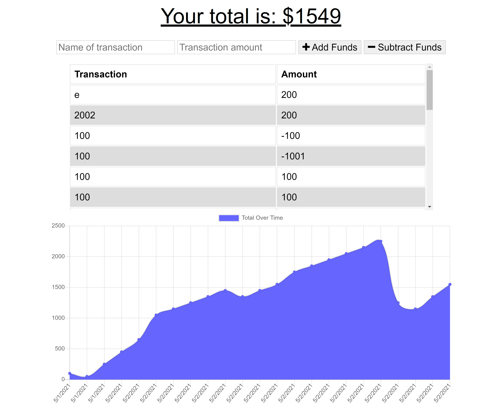

# budget-tracker

## Description

 *  Use can keep track of transactions made in their budget

 *  Budget-tracker is PWA, so it can be used offline. 

 *  Data is saved offline and can be returned to database once connection is restored

 *  Utilizes - MongoDB, NoSQL, NodeJS, HTML, CSS, Express, Mongoose

 *  Link to Github Repository: (https://github.com/jnunez1229/budget-tracker)
  

## Application in Use

